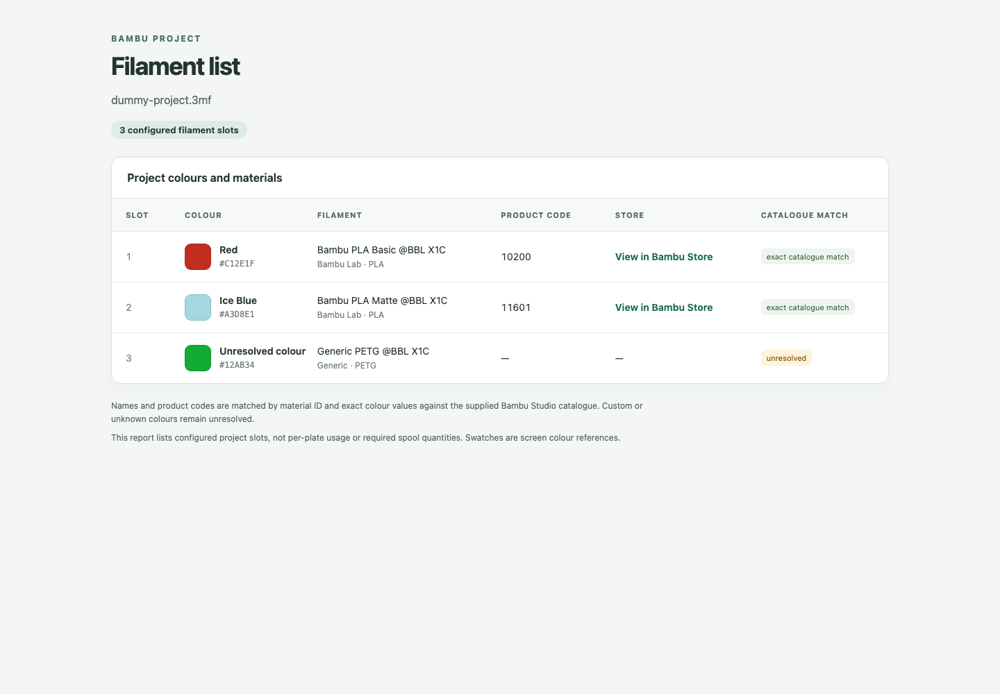

# bambu-filament-list

Extract the configured filament slots from a Bambu Studio `.3mf` project. It reports material profiles, exact colour values, Bambu colour names and product codes, plus regional Bambu Store links for exact catalogue matches.

The tool reads files locally and does not modify or upload them. It uses the Bambu colour catalogue bundled with Bambu Studio on macOS and has no third-party Python dependencies.

## Usage

```sh
uv run filament-list.py --project '/path/to/project.3mf'
```

Choose an output format and redirect it to a file:

```sh
uv run filament-list.py --project '/path/to/project.3mf' --format json > filaments.json
uv run filament-list.py --project '/path/to/project.3mf' --format csv > filaments.csv
uv run filament-list.py --project '/path/to/project.3mf' --format html > filaments.html
open filaments.html
```

The UK Bambu Store is used by default. Select another regional store with `--store-base`, such as `https://us.store.bambulab.com`. On systems where Bambu Studio is installed elsewhere, pass its `filaments_color_codes.json` using `--catalog`.

## Examples

The examples use a synthetic three-filament project containing two exact Bambu matches and one custom filament:

- [Dummy 3MF project](examples/dummy-project.3mf)
- [JSON output](examples/filaments.json)
- [CSV output](examples/filaments.csv)
- [HTML output](examples/filaments.html)

JSON:

```json
{
  "slot": 1,
  "profile": "Bambu PLA Basic @BBL X1C",
  "hex": "#C12E1F",
  "colour_name": "Red",
  "product_code": "10200",
  "match": "exact catalogue match"
}
```

CSV:

```csv
slot,profile,material,vendor,hex,colour_name,product_code,match
1,Bambu PLA Basic @BBL X1C,PLA,Bambu Lab,#C12E1F,Red,10200,exact catalogue match
```



The list describes configured project slots. It does not calculate per-plate usage, quantities, or prove which physical spool was used.
